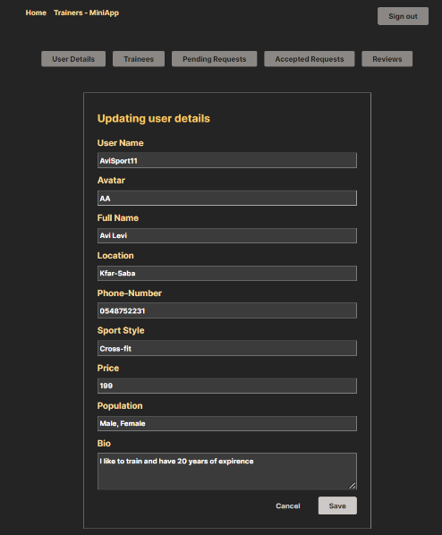

# SportSync

---

## Overview

This project is a **modern web application** designed to streamline interaction with a **reactive API** provided by a **
Java Spring Boot server**, supported by a **MongoDB** database.

The client interface, developed using **React with Typescript**, offers an intuitive and user-friendly experience for
accessing and utilizing the server's extensive API functionalities.


---

## Key Features

### Server-Side:

- **Java with Spring Boot:** Utilizes Java and Spring Boot for a resilient backend.
- **Reactive API with Netty:** Employs Netty for high performance and scalability.
- **MVC Pattern:** Follows a structured and maintainable server-side architecture.
- **MongoDB Integration:** Stores data persistently with the usage of Docker.

### Client-Side:

- **React with Typescript:** Provides a robust front-end development experience.
- **API Interaction:** Seamlessly fetches and manipulates real-time data.
- **User-Friendly Interface:** Offers an intuitive and straightforward user experience.

---

## Server

### Downloads and Installations

- **Java Spring Boot IDE:** Download and install an IDE suitable for Java Spring Boot development. (IntelliJ Idea
  ultimate edition is recommended)
- **JDK 21 or 17:** Download and install the Java Development Kit.
- **Enable CPU Virtualization:** Ensure CPU virtualization is enabled in your PC BIOS settings.
- **WSL 2:** Open Windows PowerShell as administrator and run the following command:

```bash
  wsl --install
```

- **Docker Desktop:** Download and install Docker Desktop.
- **Gradle 8.5:** Download Gradle 8.5 complete from [gradle.org/releases/](https://gradle.org/releases/) as a zip file.
    - Create a new folder named "Gradle" in your `C:\` drive.
    - Extract the Gradle zip to `C:\Gradle`.
    - Go into Windows Environment variables, under System Variable "Path" add a new path `C:\Gradle\gradle-8.5\bin`.

### Setup and Run

1. Run Docker Desktop.
2. Open your IDE and import the provided project as a Spring Initializer project.
3. Navigate to `\src\main\java\demo\integrative` and run the Application file.
4. Congratulations! You have successfully set up the server.

---

## Client

Please note that in order to run the Client, all the previous server setup steps must be completed and the server must
be running alongside the client.

### Downloads and Installations

<h1><span style="color: red">Window Instructions</span></h1>

- **JavaScript IDE: (Optional)** Download and install a suitable IDE with a JavaScript compiler (IntelliJ Idea ultimate
  edition is recommended).
- **Node.js:** Download and install the latest version of Node.js (npm is included with it)
  through [this](https://nodejs.org/en) link.

<h1> <span style="color: red">Linux Instructions</span></h1>

- **Update** Make sure to update and refresh your local package index with the following command:

```bash 
  sudo apt-get update
```

- Check whether Node is installed with the following command:

```bash 
  node -v
```

- **Node.js (if not installed):** Install the latest version of Node.js with the following command:

```bash 
  sudo apt install nodejs
```

- Check whether NPM is installed with the following command:

```bash 
  npm -v
```

- **NPM (if not installed):** Install the latest version of Node Package Manager (npm) with the following command:

```bash 
  sudo apt install npm
```

### Setup and Usage

1. Ensure the server is running.

2. Access your CLI.
3. Ensure you're on top of the client's repository folder and validate with the following command:

```bash
  ls 
```

- Make sure you see the <code>package.json</code> file.


4. Install the client's dependencies by typing the following command in your IDE terminal:

```bash
  npm install
```

5. Start the Client by typing the following command in your IDE terminal:

```bash
  npm start
```

6. The client will be launched in your default browser.

<h6><span style="color: red">In case you want to run a second client continue the following steps:</span> </h6>

7. Repeat steps 2-5 again (choose the second client repository in step 2)
8. After running npm start you will be prompted with the following message:

   

9. Press ‘Y’ if you wish to proceed or ‘N’ if you wish to abort.
10. You have successfully launched the second client on your default browser.

# Trainee Client Walkthrough
## Select Super - App

### **steps:**

- Select a super app.
- press the “Submit” button.
- Press the “Trainees- MiniApp” button at the top toolbar.

  

## User Login

### **steps:**

- Press the “Login” button in the navigation bar.
- Enter your Email into the appropriate field.
- Press the “Submit” Button.

  

## Create a New User - User registration

### **steps:**

- Click on button “Create New User” in the navigation bar.
- fill information in the appropriate field..
- press the “Save” button.

  

## Filter trainers

### **steps:**

- Click on button “Trainers” in the navigation bar.
- enter location to search for trainers.
- click on the “Submit” button.
- to see all trainers again click on “See All Trainers”.

   

## Send session request

### **steps:**

- After filtering trainers to find the trainers fitting to you: Press on the desired trainer.
- In the new “Trainer Details” page, enter the desired date in the appropriate field.
- Enter the desired time from the dropdown menu.
- press the “Send Request” button.

  

## See all requests

### **steps:**

- In the toolbar click on the button “Requests”.
- See all trainee requests with relevant details

  

## Cancel specific request

### **steps:**

- Press on the “Requests” button from the navigation bar.
- choose a session request from the list.
- press on the “Deactivated” to remove the session request

  

## Write a review

### **steps:**

- Press on the trainers’ tab on the navigation bar.
- Choose the trainer you want to write a review about.
- In the new “Trainer Details” page, enter the review in the appropriate field.
- press the “Send Review” Button.

  

## See all my reviews

### **steps:**

- Press the “Reviews” button in the toolbar
- see all the reviews you have written about trainers

  

## Edit Personal Information

### **steps:**

- Press the “User Details” button in the navigation bar.
- Press the “edit” button in the top right.
- Change personal details as needed.
- Press the “Save” button.

  

---

# Trainer Client Walkthrough


## Create a New User

### **steps:**

- In the toolbar click on button “Create New User”.
- fill information in the appropriate field.
- press the “Save” button.

  

## Reply to training request

### **steps:**

- press the “Pending Requests” button on the navigation bar.
- press the “Submit” button to see all request .
- Press on the request you wish to reply to.
- Press either the “Accept” button or the “Reject” button appropriately

  

## See all accepted requests

### **steps:**

- press on the “Requests” button on the navigation bar.
- All the accepted status requests will be presented.

  

## See all pending requests

### **steps:**

- press on the “Requests” button on the navigation bar.
- All the pending status requests will be presented.

  

## Edit Personal Information

### **steps:**

- Press the “User Details” button in the navigation bar.
- Press the “edit” button in the top right.
- Change personal details as needed.
- Press the “Save” button.

   

## See all my trainees

### **steps:**

- Press on “Trainees” on the navigation bar
- All the trainees that have had scheduled session with the trainer will be displayed

  

## Read all reviews about me

### **steps:**

- Press on the “Reviews tab on the navigation bar.
- A list of all the reviews about the trainer will be presented.

  
 
 